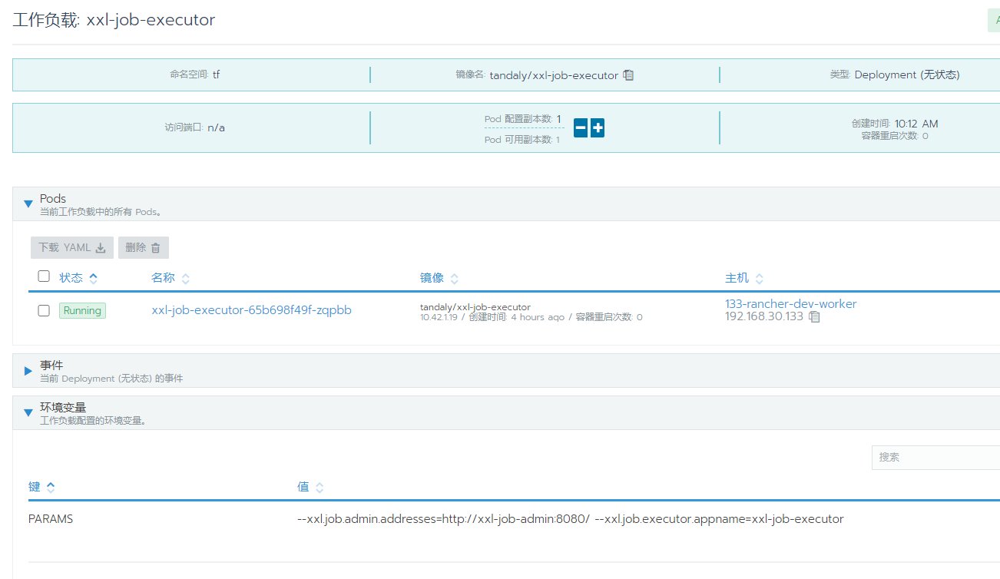

# docker-xxl-job-executor
[docker](https://hub.docker.com/repository/docker/tandaly/xxl-job-executor/builds)

[阿里云](https://cr.console.aliyun.com/repository/cn-hangzhou/tandaly/xxl-job-executor/build)

xxl-job 执行器 支持 python curl shell

如需自定义配置，可通过 "-e PARAMS" 指定，参数格式 PARAMS="--key=value --key2=value2" ； eg：PARAMS="--xxl.job.admin.addresses=http://xxl-job-svc.tools:8080/xxl-job-admin"

